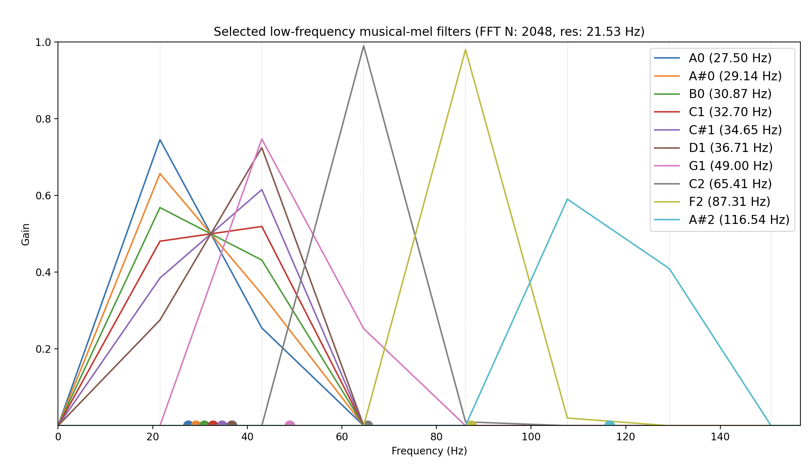
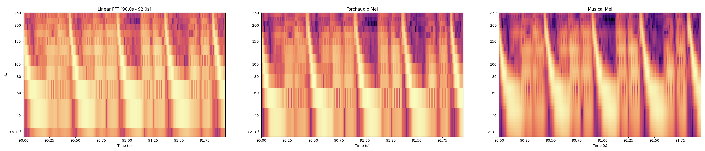
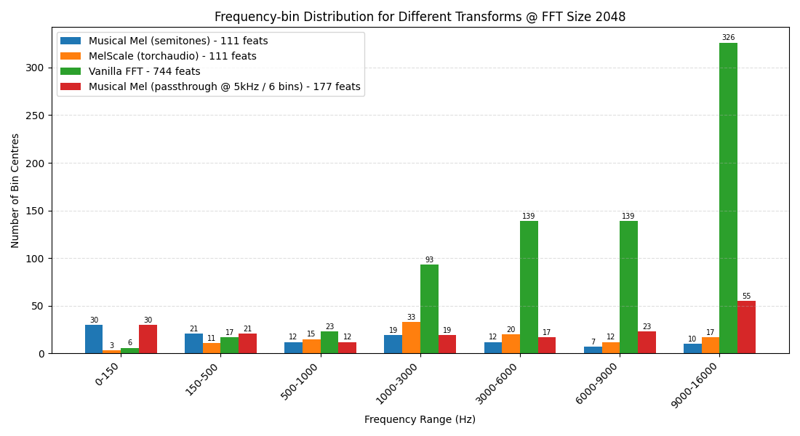

# Musical Mel Transform

[](https://badge.fury.io/py/musical-mel-transform)
[](https://pypi.org/project/musical-mel-transform/)
[](https://github.com/psf/black)
[](https://opensource.org/licenses/MIT)

```bash
pip install musical-mel-transform
```

A PyTorch-based musical mel-frequency transform for audio processing, optimized for performance and ONNX compatibility.

If you've ever wanted features in torch from an audio signal that directly represent semitones (or quarter tones!) this is the package for you.



Here, I show a few mel filters (the notes in the legend). Each gets some weight from neighboring FFT bins in such a way where the position between the FFT bins affects the weighting of the resulting mel bin so that a neural network can differentiate mel bin musical notes from one another.

## What is this and why use it?

All mel scales in torchaudio, librosa, or other packages are also logarithmically spaced bins on the frequency spectrum, but:

* Don't map to western musical scale notes
* Still have poor resolution in the low end range (especially as FFT number < 2048)
* Often are not ONNX-compatible due to usage of complex numbers in the FFT

This package aims to alleviate these issues!

### When should I use `MusicalMelTransform`?

* If you are doing something transcription or musical note related which requires discrimination on the low end
* If your case is realtime or you just need the speed that FFT-based methods provide (vs say, a CQT that would do well on low frequencies but is slow)
* If you're comparing against a completely learned filterbank, or that approach isn't working

Personally I have found this `MusicalMelTransform` (with learnable_weights="mel" to reweight for loudness) beats all the above for most of my realtime usecases.

## How does it work?

Mel scale is just a mapping of FFT bins -> new bins. So each mel bin is just a weighted sum of the usual linearly-spaced FFT bins. That's it!

This code does some adaptive widening to pick great weighted combinations of FFT bins to make pitches discernable for a downstream layer in your network. You can shorten or widen your tone granulariy -- so semi- or quarter- tones is just a parameter change.

Here's a quick comparison between:

1. Traditional linearly-spaced FFT
2. `torchaudio` mel scale transform
3. `MusicalMelTransform` (this repo)

I have constrained the two mel transforms (2 & 3) to have the same dimensionality, and be capturing up to 16khz to make the comparison fair.



As you can see, especially in the lower frequencies, the resolution of `MusicalMelTransform` is much, much better! This is great for music, and especially for low-frequency heavy music like today's pop and electronic music. The graph here shows a kick pattern, typical in house or techno music. 

Looking at the resulting features across different musically-relevant frequency ranges, we can see how different transforms vary:



As you can see:

* The vanilla FFT has a huge number of features, most of which are on veryyy high frequencies >6khz, which is non-ideal
* Under 150hz, where low or sub-"bass" lives, `MusicalMelTransform` interpolates much more smoothly
* Under 500hz, the `MusicalMelTransform` has the best coverage -- where most all the bass, root notes, and fundamental frequencies reside
* For a transform with the exact number of features, `torchaudio` transform has ~1.5x as many features from 1khz and up
* But if we're willing to spend a few more features, an optimized `MusicalMelTransform` with passthrough @ 5khz to let the FFT bins come through "covers" the torchaudio mel transform pretty much everywhere!

> ⚠️ It's important to remember all mel features are derivative of the FFT! If you're working with an FFT of size 128 or whatever, this package won't work miracles! Your resolution on low end will still be shit. I wouldn't use this package below FFT size of 512, tbh. But by cleverly assigning those FFT bins you do have, this package is a way to "stretch" the resolution you do have to make discrimination on the low end easier via smoothing interpolation. And as frequency rises, the features you'll get will be at western musical notes.

### ONNX Compatibility

`MusicalMelTransform` also uses a nice [convolutional FFT](src/musical_mel_transform/conv_fft.py) to apply the FFT in a way that is ONNX export compatible, if that is important to you. If not, just stick with the torch native FFT - it is faster.

## Usage example

### MusicalMelTransform

```python
import torch
from musical_mel_transform import MusicalMelTransform

MusicalMelTransform(
    sample_rate=44100,            # Audio sample rate
    frame_size=2048,              # FFT size
    interval=1.0,                 # Musical interval in semitones
    f_min=None,                   # Minimum frequency (Hz)
    f_max=10_000,                 # Maximum frequency (Hz)
    passthrough_cutoff_hz=8_000,  # High-freq passthrough threshold
    norm=True,                    # Normalize filterbank
    min_bins=2,                   # Minimum filter width
    adaptive=True,                # Adaptive filter sizing
    passthrough_grouping_size=3,  # High-freq bin grouping
    use_conv_fft=True,            # Use convolution-based FFT
    learnable_weights="mel"       # What kind, if any, of learnable weights to use
    power=2,                      # which power to raise output to
    to_db=True                    # convert to dB scale?
)
batch_size, frame_size = 4, 2048
audio_frames = torch.randn(batch_size, frame_size)
mel_feats, fft_mag_feats = mel_transform(audio_fraames)
```

## Quickstart in a toy torch network

```python
import torch
import torch.nn as nn
from musical_mel_transform import MusicalMelTransform

class SimpleAudioClassifier(nn.Module):
    """Simple audio classifier using musical mel features"""
    def __init__(self, frame_size: int, n_classes: int = 10):
        super().__init__()

        self.mel_transform = MusicalMelTransform(
            # sample rate in Hz
            sample_rate=44100,

            # number of samples to include / the size of the FFT
            # by default a hann window is applied as well
            frame_size=frame_size,

            # interval in semitones at which to place a mel bin
            interval=0.5,  # quarter tone resolution

            # the minimum frequency to capture. just leave this None
            # generally speaking. this transform will go as low as the
            # FFT num you've specified above will allow!
            f_min=None,

            # ignore FFT bins altogether above this frequency
            f_max=10_000,

            # between this frequency threshold and `f_max` simply 
            # let the FFT bins "pass through". this is useful because as
            # frequency increases, mel bins become spaced at *larger* 
            # intervals than FFT bins -- the opposite of low frequencies!
            passthrough_cutoff_hz=8_000,

            # dimensionality reduction technique. with passthrough FFT bins, 
            # there can be a lot of bins in upper freqs. this simply groups 
            # those bins together in ordered chunks. so a `passthrough_grouping_size=2`
            # would reduce your passthrough FFT bins by half. =1 would simply 
            # pass them all through, unchanged. 3 would reduce by 1/3 etc. 
            # the energy from the bins is simply summed into new result bin
            passthrough_grouping_size=3,

            # normalize each mel bin to unit weight?
            norm=True,

            # the minimum number of FFT bins to widen to in order to fill 
            # a mel bin. definitely want this >1, otherwise you'll 
            # just be copying nearest FFT bin!
            min_bins=2,

            # highly recommend this to be True. This does some adaptive 
            # widening to ensure that both high and low frequency bins 
            # have around the same "spread" to neighboring FFT bins
            adaptive=True,

            # this will slow down your network! but it will allow you to
            # export ONNX with dynamo=True and still have FFT. whenever 
            # onnx folks finally add complex number support this won't 
            # be needed anymore, but until then....
            use_conv_fft=True,

            # what kind, if any, learnable weights to use. Options are: 
            #   { None, "fft", "mel" }
            # if "fft", then a learnable parameter is used to 
            # elementwise multiply the raw  FFT bins before mel transform. 
            # if "mel", then elementwise multiply is after.
            # If None, then no reweighting is done and this transform has
            # no learnable parameters at all!
            learnable_weights="fft",

            # which power to raise magnitudes to. 1 is mag, 2 is power, etc
            power=2,

            # should we put this into dB scale?
            to_db=True,
        )

        # Simple classifier head
        self.classifier = nn.Sequential(
            nn.Linear(self.mel_transform.n_mel, 128),
            nn.ReLU(),
            nn.Dropout(0.2),
            nn.Linear(128, n_classes)
        )

    def forward(self, audio_frame):
        """
        Args:
            audio_frame: [batch_size, frame_size] - frames of audio
        Returns:
            logits: [batch_size, n_classes] - Classification scores
        """
        mel_features, _ = self.mel_transform(audio_frame)
        return self.classifier(mel_features)

# Example usage
model = SimpleAudioClassifier(n_classes=10, frame_size=2048)

# Process a batch of audio frames
batch_size = 4
frame_size = 2048
audio_frames = torch.randn(batch_size, frame_size)

with torch.no_grad():
    predictions = model(audio_frames)
    print(f"Predictions shape: {predictions.shape}")  # [4, 10]

# Export to ONNX
torch.onnx.export(
    model,
    audio_frames,
    "audio_classifier.onnx",
    export_params=True,
    opset_version=18,
    input_names=['audio_frame'],
    output_names=['predictions'],
    dynamic_axes=None,  # I recommend this for best performance
)
print("Model exported to audio_classifier.onnx")
```

## Installation

```bash
pip install musical-mel-transform

# or editable install
cd musical_mel_transform/
pip install -e .
```

### Different Musical Scales

`interval` is in units of semitones.

```python
chromatic_transform = MusicalMelTransform(interval=1.0)
quarter_tone_transform = MusicalMelTransform(interval=0.5)
```

### Visualization

```python
from musical_mel_transform import MusicalMelTransform, plot_low_filters

# Visualize the mel filterbank
transform = MusicalMelTransform()

plot_low_filters(
    transform,
    bank_idx_to_show=[0, 5, 10, 15, 20, 25],
    x_max_hz=1000,
    legend=True
)
```

## Demo Script

Run the interactive demo to explore different features:

```bash
# Run all demos
musical-mel-demo

# Run specific demos
musical-mel-demo --demo basic           # Basic usage
musical-mel-demo --demo params          # Parameter comparison
musical-mel-demo --demo filters         # Filterbank visualization
musical-mel-demo --demo performance     # Performance benchmarks
musical-mel-demo --demo onnx            # ONNX export
musical-mel-demo --demo musical         # Musical analysis

musical-mel-demo --demo plot_spectrums

musical-mel-demo --demo plot_spectrogram_comparison \
    --top-freq 250 \
    --segment-seconds 3

# or plot a comparison graph with your own music file! 
musical-mel-demo \
    --demo plot_spectrogram_comparison \
    --top-freq 250 \
    --segment-seconds 2 \
    --audio data/gummies.wav

# or, run all, but skip plot generation
musical-mel-demo --no-plots
```

## Running Tests

```bash
# Run all tests
pytest

# Run with coverage
pytest --cov=musical_mel_transform --cov-report=html

# Run specific test categories
pytest tests/test_fft.py -v                    # FFT tests
pytest tests/test_onnx_export.py -v           # ONNX tests

# Run performance benchmarks
pytest tests/test_fft.py::test_exact_fft_transform_matches_torch_rfft -v
pytest tests/test_fft.py::test_exact_mel_transform_matches_torch_rfft -v
```

### Code Quality

```bash
# Format code
black src/ tests/
isort src/ tests/
```

## Deployment

### Publish a new version to PyPI (step-by-step)

```bash
pip install --upgrade build twine

# 1) Bump version
# Edit src/musical_mel_transform/__init__.py (e.g., __version__ = "0.1.1")

# 2) Clean previous builds
rm -rf dist/ build/ *.egg-info

# 3) Build wheel and sdist
python -m build

# 4) Verify the artifacts
python -m twine check dist/*

# 5) (Optional) Upload to Test PyPI and verify install
python -m twine upload --repository testpypi dist/*
python -m pip install --index-url https://test.pypi.org/simple/ --no-deps musical-mel-transform

# 6) Upload to real PyPI
python -m twine upload dist/*

# 7) Verify works in a new env (if you want)
python -m venv .test_venv
source .test_venv/bin/activate
python -m pip install musical-mel-transform
```

### GitHub Release Process

1. **Update Version**: Bump version in `src/musical_mel_transform/__init__.py`
2. **Create Tag**:
   ```bash
   git tag v0.1.0
   git push origin v0.1.0
   ```
3. **Create Release**: Go to GitHub releases and create a new release from the tag

## API Reference

### MusicalMelTransform

```python
MusicalMelTransform(
    sample_rate: int = 44100,           # Audio sample rate
    frame_size: int = 2048,             # FFT size
    interval: float = 1.0,              # Musical interval in semitones
    f_min: float = 80.0,                # Minimum frequency (Hz)
    f_max: Optional[float] = None,      # Maximum frequency (Hz)
    passthrough_cutoff_hz: float = 10000, # High-freq passthrough threshold
    norm: bool = True,                  # Normalize filterbank
    min_bins: int = 2,                  # Minimum filter width
    adaptive: bool = True,              # Adaptive filter sizing
    passthrough_grouping_size: int = 3, # High-freq bin grouping
    use_conv_fft: bool = False,         # Use convolution-based FFT
    learnable_weights: str = None       # What kind, if any, of learnable weights to use
    power=2,                            # which power to raise output to
    to_db=True                          # convert to dB scale?
)
```

### ConvFFT

```python
ConvFFT(
    frame_size: int, # size of FFT
    window_type: str = {None, "hann", "hamming"}
)
```

ONNX-compatible FFT implementation using matrix multiplication.

## Performance

Performance comparison between different FFT implementations on my M1 Macbook using CPU:

| Configuration | Time (ms) |
|---------------|-----------|
| Torch FFT (frame_size=1024) | 0.01 +/- 0.01 ms |
| Conv FFT (frame_size=1024) | 0.08 +/- 0.05 ms |
| Torch FFT (frame_size=2048) | 0.02 +/- 0.01 ms |
| Conv FFT (frame_size=2048) | 0.39 +/- 0.05 ms|

*Note: Conv FFT trades some speed for ONNX compatibility and consistent cross-platform behavior.*

## Citation

If you use this library in your research, please cite:

```bibtex
@software{musical_mel_transform,
  title={Musical Mel Transform: PyTorch-based musical mel-frequency transform},
  author={Will Drevo},
  url={https://github.com/worldveil/musical_mel_transform_torch},
  year={2025}
}
```

## License

This project is licensed under the MIT License - see the [LICENSE](LICENSE) file for details.
